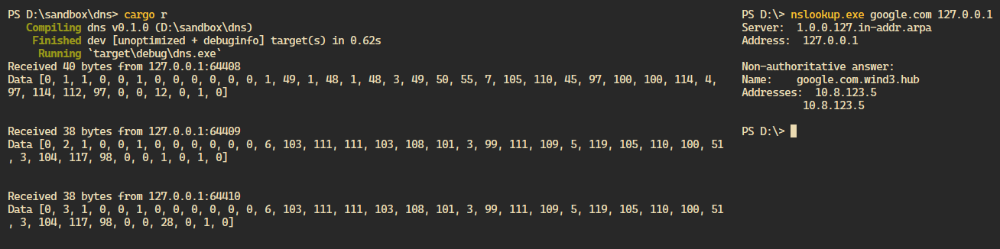

# DNS _(perché SMTP non mi piaceva!)_

Per curiosità ho voluto implementare uno dei protocolli applicativi che abbiamo visto a lezione. **HTTP** lo avevo già implementato nel primo semestre _(lo scrissi in [Rust](https://www.rust-lang.org/), insieme ad un collega che lo [fece in C](https://github.com/Warcophyr/C-web-server))_

Ho provato ad implementare SMTP, ma è una tortura a cui non voglio più sottomettermi 😅, e dopo aver visto DNS a lezione ho provato con quello _(spoiler: riuscendoci 😁!)_

Il codice è un po' incasinato _(lo scritto in un tempo relativamente breve)_, ma dovrebbe dare comunque l'idea _(e ho imparato un po' di cose sul protocollo)_

_(il server l'ho scritto in [Rust](https://www.rust-lang.org/) btw)_

## Il server

Aprire una porta e leggere i pacchetti UDP è facilissimo! Si tratta di fare il `bind()` con un **socket** (coppia **ip** e **porta**) se il sistema operativo lo permette, e creare un `loop` infinito che legge i dati dalla porta e li mette in un `buffer` _(un array)_.

La prima scoperta interessante è che se si usa UDP, il pacchetto DNS ha come limite **512 byte**, quindi non bisogna gestire un buffer dinamico, se ne può creare uno di dimensione fissata!

Quando ricevo un pacchetto UPD, mi da la dimensione del pacchetto ricevuto e l'indirizzo da cui l'ho ricevuto _(con `nslookup` la porta cambia per ogni richiesta, in genere un numero alto come 50000)_

```Rust
let socket = UdpSocket::bind(SocketAddr::from(([127, 0, 0, 1], 53))).unwrap();

let mut buffer = [0; 512]; // Ringrazio il limite di 512 byte, mi facilita il lavoro 😁!
loop {
    let (size, source) = socket.recv_from(&mut buffer).unwrap();

    // codice ...

    let request = DNSMessage::from(Box::from(buffer));
    let response = DNSMessage { ... } // Lo vediamo dopo 😉

    // codice ...

    socket.send_to(&response, source).unwrap(); // Non è proprio così, ma l'idea è quella
}
```

Nella foto un esempio di richiesta con `nslookup` _(ne fa più di 1)_ e dei dati che riceve tramite UDP il server _(dopo ne faccio un'analisi)_



## La verità dietro ai pacchetti DNS!

Un messaggio DNS completo ha tutti i campi indicati sotto... sono pochi, vero? Oltre ai campi visti a lezione, ci sono 8 byte dopo i **flag** che servono ad indicare il numero di richieste, risposte _(autoritative, non autoritative e aggiuntive)_, ed è con questo meccanismo che si fa il _parsing_ di un messaggio DNS senza separatori: sapendo in anticipo quanti _oggetti_ bisogna leggere

> `Box<[Tipo]>` sta semplicemente ad indicare un array allocato sull'**heap**, con variabili del tipo `Tipo`, nulla di troppo strano

```Rust
struct DNSMessage {
    identification: u16,
    query_reply: QueryReply, // 1 bit
    opcode: OpCode, // 4 bit
    authoritative_answer: bool, // 1 bit
    truncation: bool, // 1 bit, perché DNS su UDP ha un limite di 512 byte
    recursion_desired: bool, // 1 bit
    recursion_available: bool, // 1 bit
    _zero: (), // 3 bit, riservato per usi futuri
    response_code: ResponseCode, // 4 bit
    number_of_questions: u16, // 2 byte
    number_of_answers: u16, // 2 byte
    number_of_authority_rrs: u16, // 2 byte
    number_of_additional_rrs: u16, // 2 byte
    questions: Box<[Question]>,
    answers: Box<[ResourceRecord]>,
    authority_rrs: Box<[ResourceRecord]>,
    additional_rrs: Box<[ResourceRecord]>,
}

enum QueryReply {
    Query,
    Reply,
}

enum OpCode {
    Query,
    InverseQuery,
    Status,
}

// C'è spazio anche per usi futuri
#[non_exhaustive]
enum ResponseCode {
    NoError,
    FormatError,
    ServerFail,
    NonexistentDomain,
}

// Non ho messo tutti i tipi, dato che sono tantissimi, e c'è spazio per usi futuri!
#[non_exhaustive]
enum DNSRecordType {
    A,
    NS,
    CNAME,
    MX,
    TXT,
    AAAA,
}

struct Question {
    name: Box<[u8]>, // variabile, e vediamo dopo come viene gestito!
    dns_type: DNSRecordType, // 2 byte
    class_code: u16, // 2 byte
}

struct ResourceRecord {
    name: Box<[u8]>, // variabile
    dns_type: DNSRecordType, // 2 byte
    class_code: u16, // 2 byte
    ttl: u32, // 4 byte
    rd_length: u16, // 2 byte
    r_data: Box<[u8]>, // variabile
}
```

Ma come facciamo a gestire i campi variabili, ad esempio il dominio?

Consideriamo `google.com.wind3.hub`, viene rappresentato così:

[6, 103, 111, 111, 103, 108, 101, 3, 99, 111, 109, 5, 119, 105, 110, 100, 51, 3, 104, 117, 98, 0]

- il primo byte, con valore **6**, indica che i prossimi 6 caratteri fanno parte del dominio
- infatti `[103, 111, 111, 103, 108, 101]` è proprio la rappresentazione in ASCII di `google`
- proseguendo, abbiamo il valore **3**, stando ad indicare che i prossimi 3 caratteri fanno parte del dominio
- infatti `[99, 111, 109]` è la rappresentazione di `com`
- si procede così finché non si arriva ad un byte con valore `0` (l'ultimo byte dell'array) che sta ad indicare la fine del dominio

> Quindi nella richiesta, il dominio non viene separato dal carattere `.`, è ricavato implicitamente dalla struttura del messaggio

Il codice per parsare il dominio è relativamente semplice

```Rust
let mut index = 12;
let mut length = bytes[index];
index += 1;
let mut domain = vec![];
let mut questions = vec![];

for _ in 0..number_of_questions {
    while length > 0 {
        for _ in 0..length {
            domain.push(bytes[index]);
            index += 1;
        }
        domain.push(b'.');
        length = bytes[index];
        index += 1;
    }
    questions.push(domain); // è un po' più complicato di così, ma non di troppo
    domain.clear();
    index += 4;
}
```

## Struttura di una risposta

```Rust
let response = DNSMessage {
    identification: request.identification,
    query_reply: QueryReply::Reply,
    opcode: OpCode::Query,
    authoritative_answer: false,
    truncation: false,
    recursion_desired: false,
    recursion_available: false,
    _zero: (),
    response_code: ResponseCode::NoError,
    number_of_questions: 0,
    number_of_answers: 1,
    number_of_authority_rrs: 0,
    number_of_additional_rrs: 0,
    questions: Box::new([]),
    answers: Box::new([ResourceRecord {
        name: request.questions[0].name.clone(),
        dns_type: DNSRecordType::A,
        class_code: request.questions[0].class_code,
        ttl: 10, // 10 secondi
        rd_length: 4,
        r_data: Box::new([0, 0, 10, 8, 123, 5]),
    }]),
    authority_rrs: Box::new([]),
    additional_rrs: Box::new([]),
};
```
